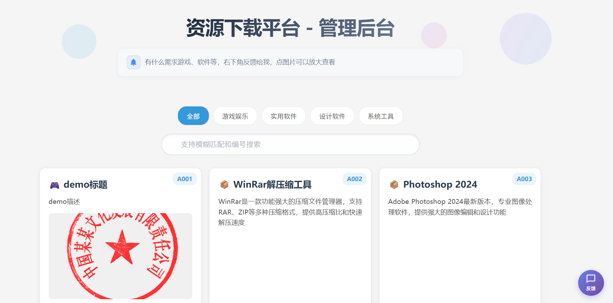
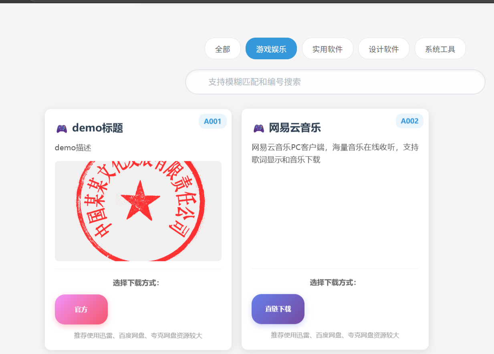
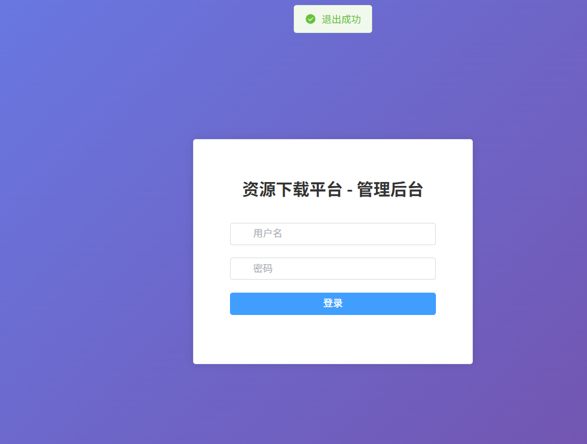
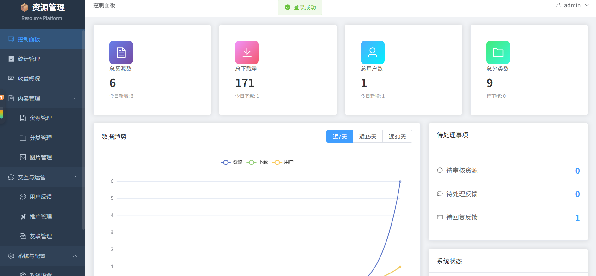
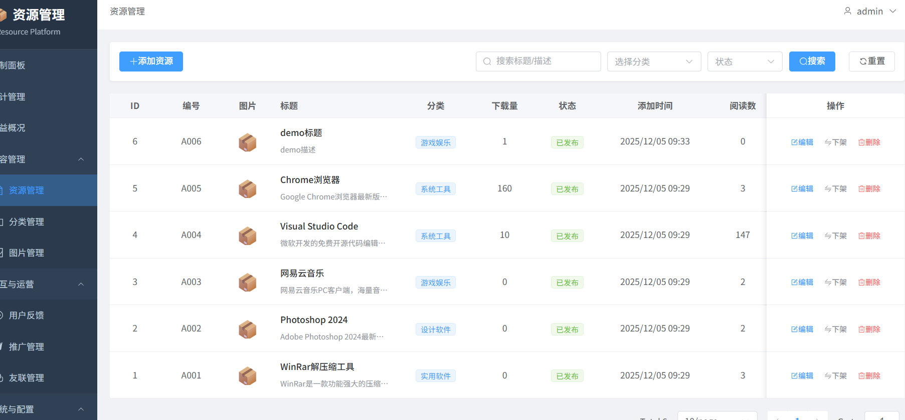
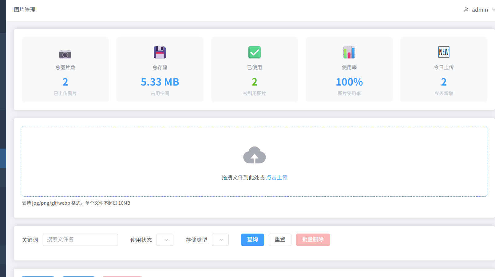
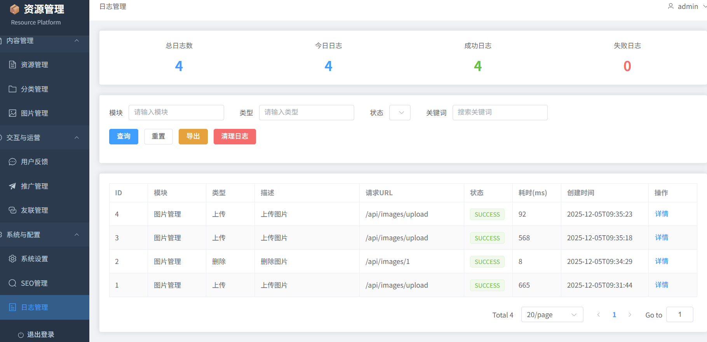
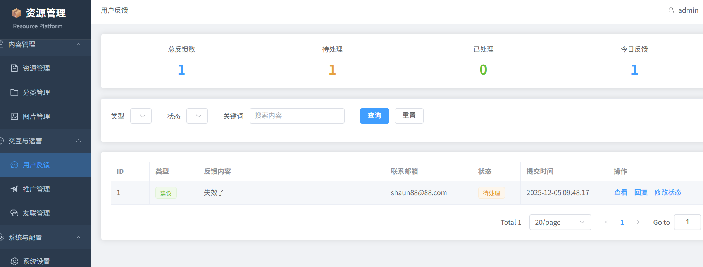

# 📸 项目功能截图展示

本文档展示资源下载平台的各个功能模块界面。

---

## 📋 目录

- [客户前台](#客户前台)
  - [首页](#1-首页)
  - [资源详情页](#2-资源详情页)
  - [分类浏览](#3-分类浏览)
- [管理后台](#管理后台)
  - [登录页面](#1-登录页面)
  - [控制面板](#2-控制面板)
  - [资源管理](#3-资源管理)
  - [分类管理](#4-分类管理)
  - [图片管理](#5-图片管理)
  - [日志管理](#6-日志管理)
  - [反馈管理](#7-反馈管理)
  - [统计管理](#8-统计管理)
  - [SEO管理](#9-seo管理)
  - [推广管理](#10-推广管理)
  - [友情链接](#11-友情链接)
  - [收益管理](#12-收益管理)
  - [系统配置](#13-系统配置)
- [API文档](#api文档)
- [移动端适配](#移动端适配)

---

## 客户前台

### 1. 首页

**功能说明：**
- 展示所有可下载的资源
- 支持分类筛选
- 支持关键词搜索
- 显示资源封面、标题、下载次数
- 响应式布局，适配各种屏幕

**截图：**



**主要功能点：**
- 顶部导航栏（Logo、搜索框）
- 分类导航（横向滚动）
- 资源卡片网格布局
- 资源信息（封面、标题、下载量）
- 点击卡片进入详情页

---

### 2. 资源详情页

**功能说明：**
- 展示资源完整信息
- 支持多图片轮播（最多5张）
- 左右切换按钮
- 图片指示器
- 点击图片查看大图
- 多个下载链接（支持不同网盘）
- 下载统计
- 链接失效反馈

**截图：**


**主要功能点：**
- 返回首页按钮
- 资源标题和描述
- 图片轮播组件
  - 左右切换按钮
  - 底部指示器
  - 图片数量提示
- 下载按钮（支持多个网盘）
- 链接失效反馈按钮
- 更新时间和下载次数

---

### 3. 分类浏览

**功能说明：**
- 按分类筛选资源
- 显示分类下的所有资源
- 支持二级分类

**截图：**



---

## 管理后台

### 1. 登录页面

**功能说明：**
- 管理员登录
- JWT身份认证
- 记住密码功能
- 表单验证

**截图：**



**默认账号：**
- 用户名：`admin`
- 密码：`admin123`

---

### 2. 控制面板

**功能说明：**
- 核心指标展示（资源数、用户数、下载量、访问量）
- 趋势分析图表
- 热门资源排行
- 待处理事项提醒
- 快速操作入口
- 系统状态监控

**截图：**




**主要功能点：**
- 数据卡片（总资源数、总用户数、总下载量、总访问量）
- 折线图（访问趋势、下载趋势）
- 热门资源排行榜（Top 10）
- 待处理事项（待审核资源、未处理反馈）
- 快速操作按钮

---

### 3. 资源管理

**功能说明：**
- 资源CRUD操作
- 富文本编辑器
- 多图片上传
- 多下载链接管理
- 资源审核
- 资源置顶
- 批量操作
- 高级搜索和筛选

**截图：**




**主要功能点：**
- 搜索框（关键词搜索）
- 筛选器（分类、状态、审核状态）
- 新增资源按钮
- 资源列表表格
  - 封面缩略图
  - 标题、分类
  - 下载量、浏览量
  - 状态（启用/禁用）
  - 审核状态（待审核/已通过/已拒绝）
  - 操作按钮（编辑、删除、置顶、审核）
- 分页组件
- 批量操作（批量删除、批量审核）

---

### 4. 分类管理

**功能说明：**
- 二级分类支持
- 树形结构展示
- 拖拽排序
- 批量操作
- 分类图标设置
- 状态管理

**截图：**


**主要功能点：**
- 新增分类按钮
- 树形表格
  - 分类名称
  - 图标
  - 排序
  - 状态
  - 资源数量
  - 操作按钮（编辑、删除、添加子分类）
- 拖拽排序功能
- 展开/折叠子分类

---

### 5. 图片管理

**功能说明：**
- 图片上传（单张/批量）
- 自动生成缩略图
- 图片压缩
- 使用情况检查
- 多种存储方式（本地/OSS/COS/七牛）
- 图片预览
- 批量删除

**截图：**





**主要功能点：**
- 上传按钮（支持拖拽上传）
- 图片网格展示
  - 缩略图
  - 文件名
  - 文件大小
  - 上传时间
  - 使用状态
  - 操作按钮（预览、复制链接、删除）
- 批量选择
- 存储方式切换
- 图片搜索

---

### 6. 日志管理

**功能说明：**
- 系统日志查询
- 操作审计
- 日志导出
- 日志清理
- 多维度筛选
- 日志统计

**截图：**




**主要功能点：**
- 日志类型切换（系统日志/访问日志）
- 时间范围筛选
- 日志级别筛选（INFO/WARN/ERROR）
- 关键词搜索
- 日志列表表格
  - 时间
  - 用户
  - 操作
  - IP地址
  - 详情
- 导出按钮
- 清理按钮

---

### 7. 反馈管理

**功能说明：**
- 反馈查询
- 反馈回复
- 状态管理（待处理/处理中/已完成/已关闭）
- 类型分类（建议/问题/投诉/其他）
- 优先级设置

**截图：**




**主要功能点：**
- 状态筛选
- 类型筛选
- 反馈列表表格
  - 用户信息
  - 反馈内容
  - 类型
  - 状态
  - 提交时间
  - 操作按钮（查看、回复、关闭）
- 回复对话框
- 状态更新

---

### 8. 统计管理

**功能说明：**
- 统计概览（总下载量、总访问量、新增访问）
- 下载分布饼图
- 下载排行榜（前5名）
- 访问统计详情表格
- 实时访问监控
- 统计周期切换（今天/昨天/近7天/近30天）

**截图：**


**主要功能点：**
- 统计周期选择器
- 数据卡片（下载量、访问量、新增用户）
- 饼图（下载分布）
- 柱状图（下载排行）
- 折线图（访问趋势）
- 详情表格（资源访问明细）
- 导出报表按钮

---

### 9. SEO管理

**功能说明：**
- SEO统计数据展示
- 自动生成网站地图（sitemap.xml）
- 批量提交URL到搜索引擎
- 提交历史记录管理
- 支持百度和必应搜索引擎

**截图：**


**主要功能点：**
- SEO统计卡片（收录量、提交量、成功率）
- 生成网站地图按钮
- 提交到搜索引擎
  - 百度提交
  - 必应提交
- 提交历史表格
  - 提交时间
  - 搜索引擎
  - URL数量
  - 状态
- 批量提交功能

---

### 10. 推广管理

**功能说明：**
- 广告位管理
- 多种广告类型（图片/文字/视频）
- 广告位置管理（首页/下载页/分类页/自定义）
- 时间段控制
- 点击统计
- 状态管理

**截图：**


**主要功能点：**
- 新增广告按钮
- 广告列表表格
  - 广告名称
  - 类型
  - 位置
  - 展示时间
  - 点击量
  - 状态
  - 操作按钮（编辑、删除、启用/禁用）
- 广告预览
- 点击统计图表

---

### 11. 友情链接

**功能说明：**
- 友情链接CRUD
- Logo管理
- 排序功能
- 状态管理
- 批量操作

**截图：**


**主要功能点：**
- 新增链接按钮
- 链接列表表格
  - Logo缩略图
  - 网站名称
  - 网站地址
  - 排序
  - 状态
  - 操作按钮（编辑、删除）
- 拖拽排序
- 批量启用/禁用

---

### 12. 收益管理

**功能说明：**
- 收益概览
- 收益类型统计（8种类型）
- 收益明细管理
- 统计周期选择
- 批量删除
- 状态管理（待结算/已结算/已取消）

**截图：**


**主要功能点：**
- 统计周期选择器
- 收益概览卡片（总收益、本月收益、待结算）
- 收益类型饼图（8种类型）
- 收益明细表格
  - 时间
  - 类型
  - 金额
  - 状态
  - 备注
  - 操作按钮（编辑、删除）
- 新增收益记录
- 批量操作

**收益类型：**
1. 广告收益
2. 会员收益
3. 下载收益
4. 推广收益
5. 打赏收益
6. 其他收益
7. 佣金收益
8. 分成收益

---

### 13. 系统配置

**功能说明：**
- 基本设置（网站名称、标题、描述等）
- SEO设置
- 存储设置
- 邮件设置
- 安全设置
- 配置分类管理
- 批量更新

**截图：**


**主要功能点：**
- 配置分类标签
- 配置表单
  - 网站名称
  - 网站标题
  - 网站描述
  - 关键词
  - ICP备案号
  - 联系邮箱
  - 存储方式
  - 上传限制
- 保存按钮
- 重置按钮

---

## API文档

**功能说明：**
- Knife4j自动生成的API文档
- 支持在线测试
- 完整的接口说明
- 请求参数和响应示例

**截图：**


**访问地址：** http://localhost:9090/doc.html

---

## 移动端适配

**功能说明：**
- 响应式设计
- 适配各种屏幕尺寸
- 触摸优化
- 移动端导航

**截图：**


---

## 📝 截图说明

### 如何添加截图

1. 在项目根目录创建 `screenshots` 文件夹
2. 按照上述文件名保存截图
3. 推荐截图尺寸：1920x1080 或 1280x720
4. 图片格式：PNG（推荐）或 JPG

### 截图命名规范

```
客户前台：
- client-home.png              # 首页
- client-detail-full.png       # 详情页整体
- client-detail-carousel.png   # 图片轮播
- client-detail-modal.png      # 大图查看
- client-category.png          # 分类浏览

管理后台：
- admin-login.png              # 登录页
- admin-dashboard.png          # 控制面板
- admin-dashboard-charts.png   # 控制面板图表
- admin-resource-list.png      # 资源列表
- admin-resource-add.png       # 新增资源
- admin-resource-edit.png      # 编辑资源
- admin-category-tree.png      # 分类树形
- admin-category-add.png       # 新增分类
- admin-image-list.png         # 图片列表
- admin-image-upload.png       # 图片上传
- admin-image-preview.png      # 图片预览
- admin-log-system.png         # 系统日志
- admin-log-access.png         # 访问日志
- admin-feedback-list.png      # 反馈列表
- admin-feedback-detail.png    # 反馈详情
- admin-feedback-reply.png     # 反馈回复
- admin-statistics-overview.png # 统计概览
- admin-statistics-charts.png   # 统计图表
- admin-statistics-detail.png   # 统计详情
- admin-seo-overview.png        # SEO概览
- admin-seo-submit.png          # SEO提交
- admin-seo-history.png         # SEO历史
- admin-promotion-list.png      # 推广列表
- admin-promotion-add.png       # 新增推广
- admin-promotion-stats.png     # 推广统计
- admin-friendlink-list.png     # 友链列表
- admin-friendlink-add.png      # 新增友链
- admin-revenue-overview.png    # 收益概览
- admin-revenue-types.png       # 收益类型
- admin-revenue-detail.png      # 收益明细
- admin-config-basic.png        # 基本配置
- admin-config-seo.png          # SEO配置
- admin-config-storage.png      # 存储配置

API文档：
- api-doc-home.png             # API文档首页
- api-doc-list.png             # 接口列表
- api-doc-detail.png           # 接口详情
- api-doc-test.png             # 在线测试

移动端：
- mobile-home.png              # 移动端首页
- mobile-detail.png            # 移动端详情
- mobile-menu.png              # 移动端菜单
```

---

## 🎨 界面设计特点

### 客户前台
- 简洁清爽的设计风格
- 卡片式布局
- 蓝色主题色
- 流畅的动画效果
- 响应式设计

### 管理后台
- Element Plus组件库
- 左侧导航菜单
- 顶部面包屑导航
- 数据可视化图表（ECharts）
- 表格操作便捷

---

## 📱 浏览器兼容性

- ✅ Chrome 90+
- ✅ Firefox 88+
- ✅ Safari 14+
- ✅ Edge 90+
- ✅ 移动端浏览器

---

## 🔗 相关链接

- [README.md](README.md) - 项目说明文档
- [QUICKSTART.md](QUICKSTART.md) - 快速启动指南
- [IMAGE_CAROUSEL_FEATURE.md](IMAGE_CAROUSEL_FEATURE.md) - 图片轮播功能说明

---

**注意：** 本文档中的截图为占位符，请按照实际运行的界面进行截图并替换。
